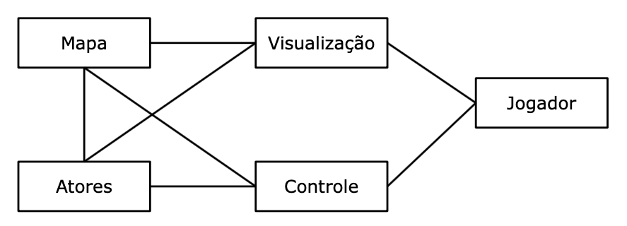
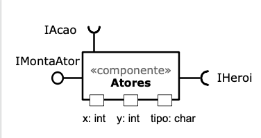
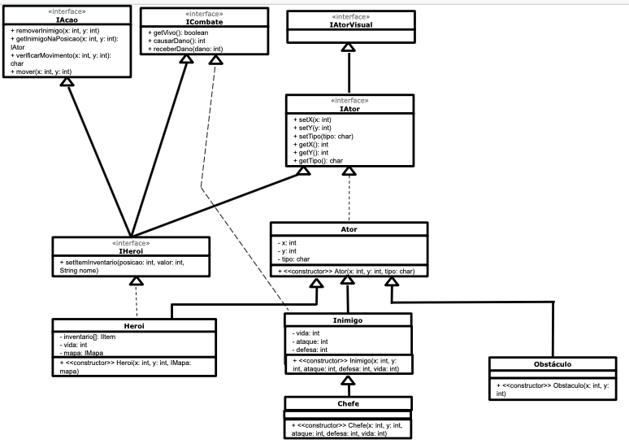
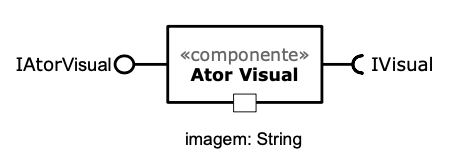
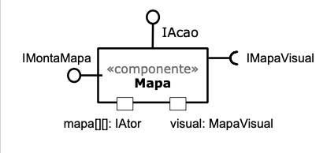
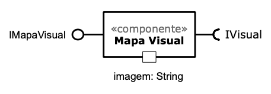
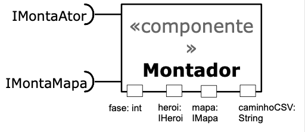
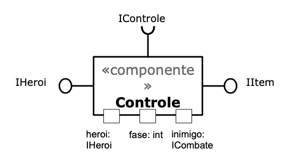
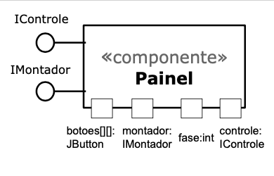
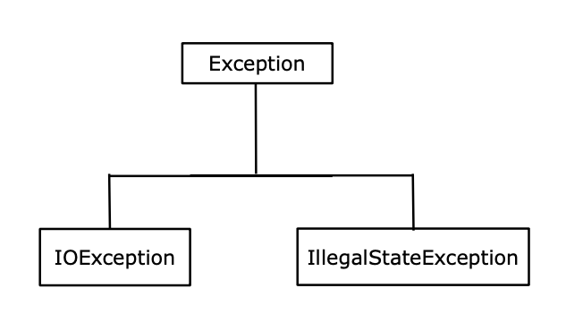

# Projeto "O Herói das Eras"

# Descrição do Projeto

300.000 anos antes da era comum, nasce um guerreiro.

Este rapaz está destinado, pelas forças da natureza, a lutar contra o mal ao
longo das centenas de milhares de anos da existência da humanidade.

Abençoado pelas moiras, três mulheres responsáveis por fabricar, tecer e cortar 
o fio da vida dos homens, somente aqueles que descendem do mal podem matá-lo.

Conseguirá o herói cumprir sua missão? Isso depende somente de você...

# Equipe

* Fábio de Andrade Barboza - RA 168817
* João Augusto Rosa Feltran - RA 174083

# Estrutura de Arquivos e Pastas

~~~
├── README.md          <- apresentação do projeto
│
├── assets             <- mídias usadas no projeto
│
├── data               <- dados usados pelo jogo
│
└── src                <- projeto em Java 
    │
    ├── bin            <- arquivos em bytecode (.class)
    │
    ├── src            <- arquivos-fonte do projeto (.java)
    │
    └── README.md      <- instruções básicas de instalação/execução
~~~

# Vídeos

## Vídeo da Prévia

](assets/Apresentacao/Thumbnail-Previa.png)

# Slides

## Slides da Prévia

[Slides da prévia](assets/Apresentacao/Slides-Previa.pdf)

# Documentação dos Componentes

# Diagramas

## Diagrama Geral do Projeto

O jogo foi planejado com base no estilo "Model-View-Control". O Jogador tem acesso a um painel ("View"), que apresenta um Mapa e seus Atores("Model") ao Jogador e permite que este se mova e interaja com outros Atores ("Control"). 

## Componente Ator

Representa as diferentes entidades que interagem durante o jogo: o Herói, Inimigos e Obstáculos.

**Ficha Técnica**
Item | Detalhamento
----- | -----
Classe | src.Atores
Autores | Fábio de Andrade Barboza, João Augusto Rosa Feltran
Interfaces | IAcao, IAtor, IAtorVisual, ICombate, IHeroi

### Interfaces

Interface agregadora do componente em Java:

~~~java
package src.Ator;

public interface IAtor{
    // Setters
    public void setX(int x);
    public void setY(int y);
    public void setTipo(char tipo);

    // Getters
    public int getX();
    public int getY();
    public char getTipo();
}
~~~

### Interface IAcao

Interação do Herói com o Mapa.

Método | Objetivo
-------| --------
void removerInimigo(int x, int y) | Remove o Inimigo do Mapa na posição (x, y)
IAtor getInimigoNaPosicao(int x, int y) | Retorna o tipo de Ator presente na posição (x, y)
char verificarMovimento(int x, int y) | Verifica se o movimento até a posição (x, y) é válido
void mover(int x, int y) | Move o Ator para a posição (x, y)

### Interface ICombate

Gerencia as interações de combate entre Atores.

Método | Objetivo
-------| --------
boolean getVivo() | Verifica se a Vida do Ator é maior que zero
int causarDano() | Calcula o dano causado pelo Ator ao atacar
void receberDano(int dano) | Diminui a vida do Ator com base no dano recebido e seus atributos

### Interface IHeroi

Agrega as interfaces implementadas pelo Herói e gerencia o inventário do mesmo.

Método | Objetivo
-------| --------
void setItemInventario(int posicao, int valor, String nome) | Cria e adiciona um novo item no inventário, de acordo com os parâmetros recebidos
   
## Componente Ator Visual

Apresenta o componente Ator na tela. 

**Ficha Técnica**
Item | Detalhamento
----- | -----
Classe | src.AtorVisual
Autores | Fábio de Andrade Barboza, João Augusto Rosa Feltran
Interfaces | IAtorVisual, IVisual

## Componente Mapa

Armazena a posição dos componentes Atores.

**Ficha Técnica**
Item | Detalhamento
----- | -----
Classe | src.Mapa
Autores | Fábio de Andrade Barboza
Interfaces | IAcao, IMapa, IMapaPropriedades, IMapaVisual

## Componente Mapa Visual

Apresenta o componente Mapa na tela. 

**Ficha Técnica**
Item | Detalhamento
----- | -----
Classe | src.MapaVisual
Autores | Fábio de Andrade Barboza, João Augusto Rosa Feltran
Interfaces | IMapaVisual, IVisual

## Componente Montador

Cria os componentes Atores e Mapa.

**Ficha Técnica**
Item | Detalhamento
----- | -----
Classe | src.Montador
Autores | João Augusto Rosa Feltran
Interfaces | IMontadorAtores, IMontadorMapa

## Componente Controle

Controla o estado do jogo.

**Ficha Técnica**
Item | Detalhamento
----- | -----
Classe | src.Controle
Autores | Fábio de Andrade Barboza
Interfaces | IControle, IControleVisual, IHeroi

## Componente Painel

Interacao com o jogador e apresentação do jogo na tela. 

**Ficha Técnica**
Item | Detalhamento
----- | -----
Classe | src.Painel
Autores | Fábio de Andrade Barboza, João Augusto Rosa Feltran
Interfaces | IControleVisual, IVisual

# Plano de Exceções

## Diagrama da hierarquia de exceções

## Descrição das classes de exceção

Classe | Descrição
----- | -----
IOException | Verifica se o arquivo foi aberto corretamente.
TamanhoInvalido | Indica que o arquivo .csv lido não tem um tamanho adequado para criar um mapa.
MapaInvalido | Indica que o mapa armazenado no arquivo .csv é inválido.
