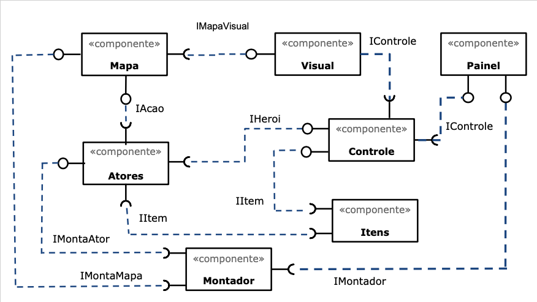

# Projeto "O Herói das Eras"

# Descrição do Projeto

300.000 anos antes da era comum, nasce um guerreiro.

Este rapaz está destinado, pelas forças da natureza, a lutar contra o mal ao
longo das centenas de milhares de anos da existência da humanidade.

Abençoado pelas moiras, três mulheres responsáveis por fabricar, tecer e cortar 
o fio da vida dos homens, somente aqueles que descendem do mal podem matá-lo.

Conseguirá o herói cumprir sua missão? Isso depende somente de você...

# Equipe

* Fábio de Andrade Barboza - RA 168817
* João Augusto Rosa Feltran - RA 174083

# Estrutura de Arquivos e Pastas

~~~
├── README.md          <- apresentação do projeto
│
├── assets             <- mídias usadas no projeto
│
├── data               <- dados usados pelo jogo (.csv)
│
└── src                <- projeto em Java 
    │
    ├── bin            <- arquivos em bytecode (.class)
    │
    ├── src            <- arquivos-fonte do projeto (.java)
    │
    └── README.md      <- instruções básicas de instalação/execução
~~~

# Vídeos do Projeto

## Vídeo da Prévia

[Vídeo da prévia](https://drive.google.com/file/d/1uszDQPCGeER__hJ6rSXI5SbTS8QNMBl6/view?usp=sharing)

## Vídeos do Jogo

[Vídeo do jogo](https://drive.google.com/file/d/1FMIGBxfel2OFO-7UKeGbSDYQVWsR2bZh/view?usp=sharing)

[Vídeo do jogo completo](https://drive.google.com/file/d/197np9WtcwXe0baI0MZ2JjPMWj9X8xRG_/view?usp=sharing)

# Slides do Projeto

## Slides da Prévia

[Slides da prévia](assets/Apresentacao/Slides-Previa.pdf)

## Slides da Apresentação Final

* TODO

## Relatório de Evolução

O jogo foi planejado com base no estilo "Model-View-Control". O Jogador tem acesso a um painel ("View"), que apresenta um Mapa e seus Atores("Model") ao Jogador e permite que este se mova e interaja com outros Atores ("Control"). 
A maior dificuldade enfrentada durante a elaboração do Projeto foi conciliar múltiplas janelas. Inicialmente, uma única janela seria utlizada para os mapas de todas as fases, e, ao iniciar um combate, uma nova janela seria aberta para interação com o jogador. Não foi possível, porém, fazer o programa esperar até que essa janela fosse fechada antes de continuar a execução. Assim, optamos por uma versão um pouco mais simples, em que o jogador precisaria apenas clicar sobre o inimigo para realizar um ataque. Aleatoriamente, o programa decide se a ação foi bem sucedida ou se o inimigo se defendeu e revidou o ataque.
Outra mudança em relação ao planejamento inicial do jogo é a criação de uma classe própria para os Itens, que melhoram alguns atributos do Herói e permitem que o jogador conclua a fase atual. 
Neste projeto, tentamos ao máximo utilizar interfaces em java.

# Destaques de Código

~~~java
public class PainelPrincipal extends JFrame implements IPainelPrincipal {
    ...
    public void actionPerformed(ActionEvent e) {
        if (e.getSource() == jogar1) { // Se o jogador apertar o botão "jogar" na tela inicial
            criarTela2(); // Cria a segunda tela inicial do jogo
        } else if (e.getSource() == jogar2) { // Se o jogador apertar o botão "jogar" na segunda tela inicial
            criarMapa(fase); // Cria o mapa e os botões
        } else { // Descobre o botão que o jogador clicou
            for (int i = 0; i < 7; i ++) { 
                for (int j = 0; j < 7; j ++) {
                    if (e.getSource() == botoes[i][j]) {
                        controle.jogada(i, j); // Informa a jogada ao controle
                        atualizarMapa(); // Atualiza a parte visual após a jogada
                    }
                }
            }
        }
    }
}
~~~

Destacamos este trecho de código do programa que representa a independência dos componentes Controle e PainelPrincipal, além de ilustrar a utilização da interface gráfica. 

# Destaques de Pattern
`<Destaque de patterns adotados pela equipe. Sugestão de estrutura:>`

* TODO

## Diagrama do Pattern
`<Diagrama do pattern dentro do contexto da aplicação.>`

* TODO

## Código do Pattern
~~~java
// Recorte do código do pattern seguindo as mesmas diretrizes de outros destaques
public void algoInteressante(…) {
   …
   trechoInteressante = 100;
}
~~~

> <Explicação de como o pattern foi adotado e quais suas vantagens, referenciando o diagrama.>

* TODO

# Conclusões e Trabalhos Futuros

Este jogo possui um potencial muito grande para futuras melhorias. 
Gostaríamos de implementar a interface gráfica de batalha planejada inicialmente, além de adicionar uma barra de vida do Herói e do inimigo em questão.
Outra possibilidade de expansão seria a criação de fases aleatórias, em vez de lidas de um arquivo CSV.
Melhorias de design possíveis incluem a utilização de Factories para criação dos componentes do jogo.

# Documentação dos Componentes

* TODO

# Diagramas

## Diagrama Geral do Projeto

O jogo foi planejado com base no estilo "Model-View-Control". O Jogador tem acesso a um painel ("View"), que apresenta um Mapa e seus Atores("Model") ao Jogador e permite que este se mova e interaja com outros Atores ("Control"). 

## Componente Ator

Representa as diferentes entidades que interagem durante o jogo: o Herói, Inimigos e Obstáculos.

**Ficha Técnica**
Item | Detalhamento
----- | -----
Classe | src.Atores
Autores | Fábio de Andrade Barboza, João Augusto Rosa Feltran
Interfaces | IAcao, IAtor, IAtorVisual, ICombate, IHeroi

### Interfaces

Interface agregadora do componente em Java:

~~~java
package src.Ator;

public interface IAtor{
    // Setters
    public void setX(int x);
    public void setY(int y);
    public void setTipo(char tipo);

    // Getters
    public int getX();
    public int getY();
    public char getTipo();
}
~~~

### Interface IAcao

Interação do Herói com o Mapa.

Método | Objetivo
-------| --------
void removerInimigo(int x, int y) | Remove o Inimigo do Mapa na posição (x, y)
IAtor getInimigoNaPosicao(int x, int y) | Retorna o tipo de Ator presente na posição (x, y)
char verificarMovimento(int x, int y) | Verifica se o movimento até a posição (x, y) é válido
void mover(int x, int y) | Move o Ator para a posição (x, y)

### Interface ICombate

Gerencia as interações de combate entre Atores.

Método | Objetivo
-------| --------
boolean getVivo() | Verifica se a Vida do Ator é maior que zero
int causarDano() | Calcula o dano causado pelo Ator ao atacar
void receberDano(int dano) | Diminui a vida do Ator com base no dano recebido e seus atributos

### Interface IHeroi

Agrega as interfaces implementadas pelo Herói e gerencia o inventário do mesmo.

Método | Objetivo
-------| --------
void setItemInventario(int posicao, int valor, String nome) | Cria e adiciona um novo item no inventário, de acordo com os parâmetros recebidos
   
## Componente Ator Visual

Apresenta o componente Ator na tela. 

**Ficha Técnica**
Item | Detalhamento
----- | -----
Classe | src.AtorVisual
Autores | Fábio de Andrade Barboza, João Augusto Rosa Feltran
Interfaces | IAtorVisual, IVisual

## Componente Mapa

Armazena a posição dos componentes Atores.

**Ficha Técnica**
Item | Detalhamento
----- | -----
Classe | src.Mapa
Autores | Fábio de Andrade Barboza
Interfaces | IAcao, IMapa, IMapaPropriedades, IMapaVisual

## Componente Mapa Visual

Apresenta o componente Mapa na tela. 

**Ficha Técnica**
Item | Detalhamento
----- | -----
Classe | src.MapaVisual
Autores | Fábio de Andrade Barboza, João Augusto Rosa Feltran
Interfaces | IMapaVisual, IVisual

## Componente Montador

Cria os componentes Atores e Mapa.

**Ficha Técnica**
Item | Detalhamento
----- | -----
Classe | src.Montador
Autores | João Augusto Rosa Feltran
Interfaces | IMontadorAtores, IMontadorMapa

## Componente Controle

Controla o estado do jogo.

**Ficha Técnica**
Item | Detalhamento
----- | -----
Classe | src.Controle
Autores | Fábio de Andrade Barboza
Interfaces | IControle, IControleVisual, IHeroi

## Componente Painel

Interacao com o jogador e apresentação do jogo na tela. 

**Ficha Técnica**
Item | Detalhamento
----- | -----
Classe | src.Painel
Autores | Fábio de Andrade Barboza, João Augusto Rosa Feltran
Interfaces | IControleVisual, IVisual

# Plano de Exceções

## Diagrama da hierarquia de exceções

## Descrição das classes de exceção

Classe | Descrição
----- | -----
IOException | Verifica se o arquivo foi aberto corretamente.
TamanhoInvalido | Indica que o arquivo .csv lido não tem um tamanho adequado para criar um mapa.
MapaInvalido | Indica que o mapa armazenado no arquivo .csv é inválido.
